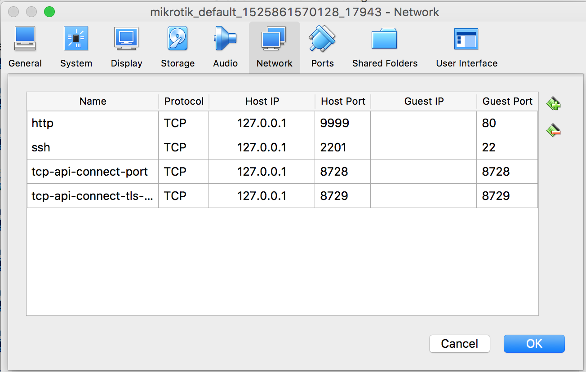

# Mikrotik Example

This project uses java api provided by [Mikrotik-java](https://github.com/GideonLeGrange/mikrotik-java) to connect to a mikrotik routerOS and execute some 
commands. 

## Initial setup

Follow the [blog](http://myhomelab.blogspot.com/2013/05/installing-mikrotik-routeros-under-VirtualBox.html) to setup Mikrotik routerOS virtualbox locally.

## Port forwarding on virtual box



## Running the project

Each command is part of a separate spring boot command line runner. To execute all the commands simply run the following command - 

```$bash
./gradlew build
```


